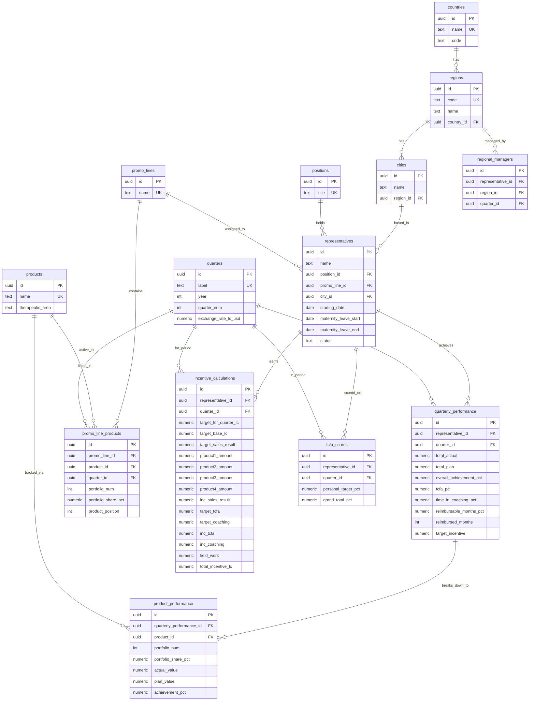

# Supabase Normalized Database Migration Plan

## Background

Migrate the EPD Incentive Dashboard data from flat Excel/CSV files into a normalized PostgreSQL database on **Supabase**. The current data is a denormalized, single-array blob (`comprehensive_data.js`) with ~90 records per quarter, combining staff info, product performance, TCFA scores, and financial summaries into one massive flat object per rep.

## Current Data Sources (9 CSV files)

| File | Purpose | Key Fields |
|---|---|---|
| `Staff_Input.csv` | Employee roster | Name, Position, Start Date, Leave dates, Quarterly work status |
| `Promo_Product_Input.csv` | Product-to-PromoLine mapping per quarter | PromoLine, Portfolio shares, Product names |
| `INPUT_ASSUMPTIONS_CALC.csv` | Detailed performance (actuals vs plans) | Quarter, Rep, Products (P1-P4), Act/Plan values, TCFA%, Achievement% |
| `Summary_calculation.csv` | Financial summary | Target incentives, Product payouts, TCFA/Coaching amounts |
| `TCFA.csv` | TCFA compliance scores | Rep name, Q1-Q4 percentages |
| `Mapping.csv` | Rep-to-Region-to-Manager hierarchy | Rep, City, Regional Manager, PromoLine |
| `TIC.csv` | Time in Coaching data | Manager coaching % |
| `To_sign.csv` | Approval/sign-off data | Sign-off records |

---

## Proposed Normalized Schema (3NF)



## User Review Required

> [!IMPORTANT]
> **Supabase Project**: You'll need to create a Supabase project at [supabase.com](https://supabase.com) and provide the **project URL** and **anon/service_role key** before we can connect the Next.js app.

> [!WARNING]
> **Data Accuracy**: The CSV data contains some quirks:
> - Numbers use comma thousands separators (`"395,525.00"`) — the migration script will clean these
> - Some names have Cyrillic characters in the Mapping/TCFA files — we'll match on English names only
> - `Country` is not explicit in the data (currently hardcoded as Kazakhstan) — do you have data for Country 87 (Georgia) mentioned in `Summary_calculation.csv`?
> - Some reps appear multiple times (e.g., `Issakova Dina` with different date ranges) — this is handled as separate assignment periods

## Proposed Changes

### Phase 1: Database Schema

#### [NEW] `supabase/migrations/001_create_schema.sql`
- SQL migration file with all 13 tables above
- RLS (Row Level Security) policies for read access
- Indexes on foreign keys and commonly filtered columns (`quarter_id`, `representative_id`)
- Composite unique constraints to prevent duplicate entries

---

### Phase 2: Seed Script

#### [NEW] `scripts/seed_supabase.ts`
A Node.js/TypeScript script that:
1. Reads all 9 CSV files from `New/csv_exports/`
2. Parses and deduplicates **lookup tables** (countries, regions, cities, positions, promo_lines, products, quarters)
3. Creates **representatives** by cross-referencing `Staff_Input.csv` + `Mapping.csv`
4. Inserts **quarterly_performance** + **product_performance** from `INPUT_ASSUMPTIONS_CALC.csv`
5. Inserts **incentive_calculations** from `Summary_calculation.csv`
6. Inserts **tcfa_scores** from `TCFA.csv`
7. Builds **promo_line_products** from `Promo_Product_Input.csv`

Uses `@supabase/supabase-js` for insertion with upsert to be idempotent.

---

### Phase 3: Next.js Integration

#### [NEW] `nextjs/lib/supabase.ts`
- Supabase client initialization using env vars (`NEXT_PUBLIC_SUPABASE_URL`, `NEXT_PUBLIC_SUPABASE_ANON_KEY`)

#### [MODIFY] `nextjs/hooks/useFilteredData.ts`
- Replace static import of `comprehensiveData` with a Supabase query
- Use React Server Components or `useEffect` + `useState` for data fetching
- Keep the `useMemo` filtering on the client side after fetch

#### [MODIFY] `nextjs/components/Dashboard.tsx`
- Add loading state while data is fetched from Supabase
- Error state handling for network issues

#### [NEW] `nextjs/.env.local`
```
NEXT_PUBLIC_SUPABASE_URL=your-project-url
NEXT_PUBLIC_SUPABASE_ANON_KEY=your-anon-key
```

---

## Normalization Benefits

| Before (Flat JSON) | After (Normalized DB) |
|---|---|
| 35+ fields per record, highly redundant | 13 focused tables, no redundancy |
| Rep name duplicated in every record | Single `representatives` row, referenced by UUID |
| Product names repeated per record | `products` lookup table with therapeutic area |
| No referential integrity | Foreign keys + constraints |
| ~107KB static JS file loaded every page | On-demand queries — fetch only what's needed |
| Can't query "show all reps for Line 1" efficiently | SQL JOINs + indexes, sub-millisecond |
| Adding a new quarter = regenerate entire file | Insert new rows, existing data untouched |

## Open Questions

> [!IMPORTANT]
> 1. **Do you already have a Supabase project?** If not, I'll guide you through creating one (free tier is sufficient for this dataset).
> 2. **Country data**: Should I add Georgia (Country 87) as a separate country, or is all current data Kazakhstan-only?
> 3. **Historical quarters**: The data currently has Q1 2017 and Q2 2017. Will you be adding more quarters over time? This affects whether we should build an "upload new quarter" admin feature.
> 4. **Authentication**: Do you need user authentication (Supabase Auth), or is this an internal dashboard with open read access?

## Verification Plan

### Automated Tests
- Run seed script against a fresh Supabase instance
- Query `SELECT COUNT(*)` on all tables to verify row counts match CSV
- Run a JOIN query that reconstructs the original flat record and compare against `comprehensive_data.js`

### Manual Verification
- Open the Next.js dashboard and verify all filters work with live Supabase data
- Switch between Detailed and Summary views to confirm data matches the original
- Compare at least 5 representative records field-by-field against the Excel source
